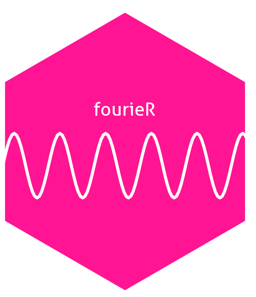

# fourieR


 
<!-- badges: start -->
<!-- badges: end -->

The goal of fourieR is to ...

## Installation

You can install the development version of fourieR from [GitHub](https://github.com/) with:

``` r
# install.packages("pak")
pak::pak("ryannruehman/freqnomenal")
```

## Example

This is a basic example which shows you how to solve a common problem:

``` r
library(fourieR)
## basic example code
```

